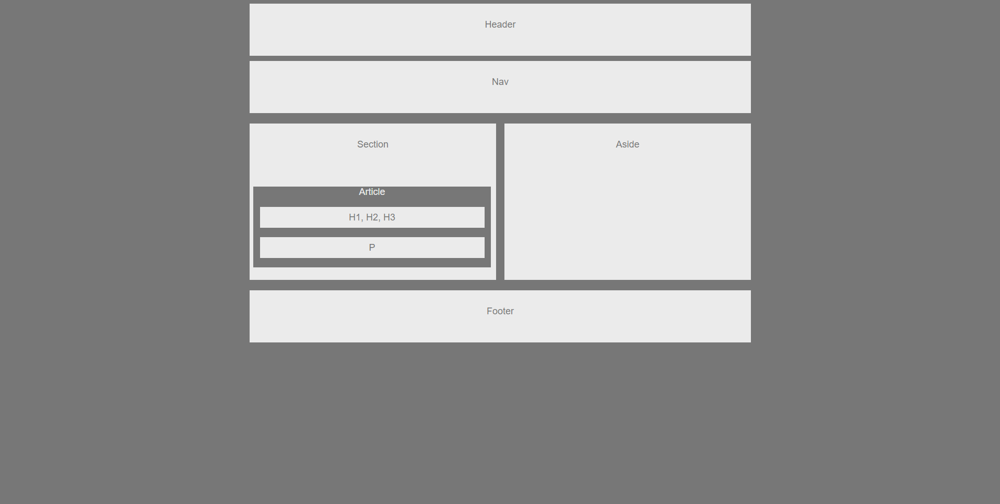

# HW-Wireframe

## Description: Using boxes seeing how margin, padding, float, and positions work

## How it is organaize:
### No funcionality just a visual

## How to run the app:
### 1. Git clone this repo
### 2. open index.html in your browser

### You can view the app here
### https://armjim14.github.io/HW-Wireframe/

## Home page

